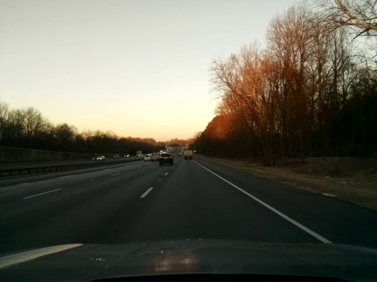
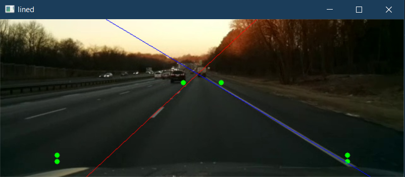
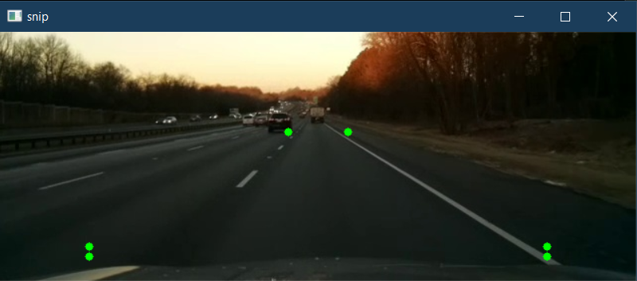
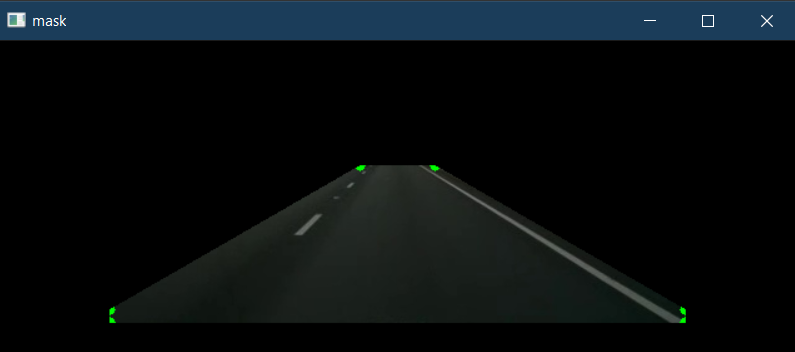
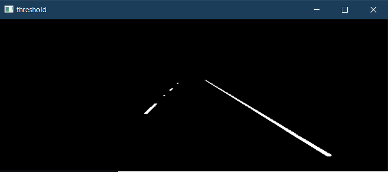
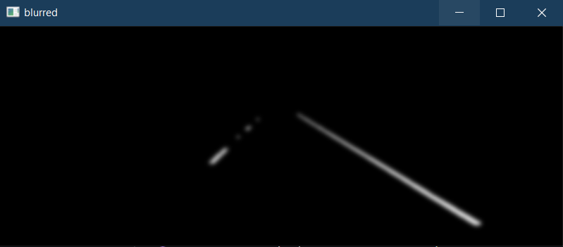
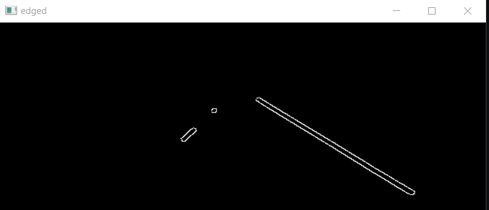

# Lane Detection Project

This repository contains scripts and notebooks for lane detection using OpenCV and NumPy. The project demonstrates lane detection on both video streams and single images, providing step-by-step image processing pipelines and visualizations.

## Contents

- `lanedetection_video.py` / `lanedetection_video.ipynb`: Lane detection on video files.
- `lanedetect_single_image.py` / `lanedetection_single_image.ipynb`: Lane detection on a single image.
- `images/`: Sample images and intermediate processing results.
- `video/`: Sample input and output videos.
- `requirements.txt`: Python dependencies.

---

## Lane Detection on Video

This script performs lane detection on a video stream. Each frame is processed to detect and highlight lane lines, providing a real-time visualization.

### Video Script Overview

- **Input:** A video file  
  [](video/test_video_01.mp4)
- **Output:** Video frames with detected lane lines overlaid, displayed in a window  
  [](video/output_lanes.mp4)

### Video Script Main Steps

1. **Video Loading:** Opens the video file and processes it frame by frame.
2. **Image Snipping:** Crops the region of interest from each frame to focus on the road area.
3. **Masking:** Applies a polygonal mask to isolate the lane area.
4. **Thresholding:** Highlights white and yellow lane markings using color masks in HSV color space.
5. **Blurring:** Applies Gaussian blur to reduce noise and improve edge detection.
6. **Edge Detection:** Uses the Canny algorithm to find edges in the frame.
7. **Line Detection:** Uses the Hough Transform to detect lines corresponding to lane markers.
8. **Line Averaging and Drawing:** Averages detected lines using a moving average for stability, then draws the left and right lane lines on the frame.
9. **Display:** Shows the processed frame with detected lanes in a window. Press 'q' to quit early.

### Video Script Functions

- `snip_image(image)`: Crops the lower part of the frame to focus on the road.
- `mask_image(image)`: Applies a polygonal mask to the frame to isolate the lane area.
- `thresh_image(image)`: Applies color and grayscale thresholding to highlight lane lines.
- `blur_image(image)`: Applies Gaussian blur to the frame.
- `edge_image(image)`: Detects edges using the Canny algorithm.
- `lined_image(image)`: Detects lines using the Hough Transform.
- `show_line(lines, snip, color)`: Draws averaged lane lines on the frame using a moving average for stability.
- `moving_average(snip, ptsL, ptsR)`: Maintains a moving average of detected lane line points for smoother visualization.
- `main()`: Orchestrates the lane detection pipeline for each video frame and displays the result.

### How to Run the Video Script

Run the script directly:

```bash
python lanedetection_video.py
```

A window will display the video with detected lane lines. Press 'q' to exit before the video ends.

---

## Lane Detection on a Single Image

This script performs lane detection on a single image. The process involves several image processing steps to isolate and highlight lane lines in a road image.

### Single Image Script Overview

- **Input:** A road image  
  
- **Output:** The input image with detected lane lines overlaid  
  

### Single Image Script Main Steps

1. **Image Snipping:** Crops the region of interest from the bottom of the image where lanes are expected.  
   
2. **Masking:** Applies a polygonal mask to focus on the lane area.  
   
3. **Thresholding:** Converts the image to HSV and grayscale, then applies a mask to highlight white lane markings.  
   
4. **Blurring:** Uses Gaussian blur to reduce noise.  
   
5. **Edge Detection:** Applies Canny edge detection to find lane edges.  
   
6. **Line Detection:** Uses Hough Transform to detect lines corresponding to lane markers.
7. **Drawing Lines:** Averages detected lines and draws them on the original snipped image.  
   

### Single Image Script Functions

- `snip_image(image)`: Crops the lower part of the image to focus on the road.
- `mask_image(image)`: Applies a polygonal mask to the image to isolate the lane area.
- `thresh_image(image)`: Applies color and grayscale thresholding to highlight lane lines.
- `blur_image(image)`: Applies Gaussian blur to the image.
- `edge_image(image)`: Detects edges using the Canny algorithm.
- `lined_image(image)`: Detects lines using the Hough Transform.
- `main()`: Orchestrates the lane detection pipeline and displays the result.

### How to Run the Single Image Script

Run the script directly:

```bash
python lanedetect_single_image.py
```

The result will be displayed in a window showing the detected lane lines.

---

## Requirements

- Python 3.x
- OpenCV (`cv2`)
- NumPy
- imutils

Install dependencies with:

```bash
pip install -r requirements.txt
```

## Notes

- The scripts are designed for demonstration and may require parameter tuning for different images, videos, or camera perspectives.
- The region of interest and mask polygon are hardcoded for the sample data and may need adjustment for other inputs.
- The video script uses a moving average to stabilize lane line detection across frames.

---

Author: Ian Edmundson  
Date: August 2025
