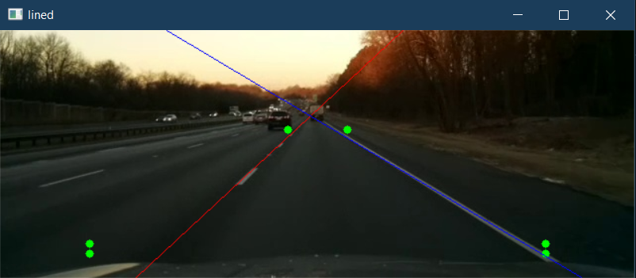
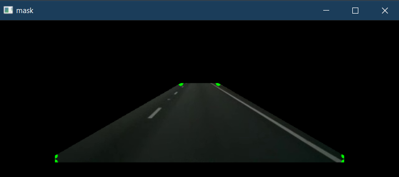
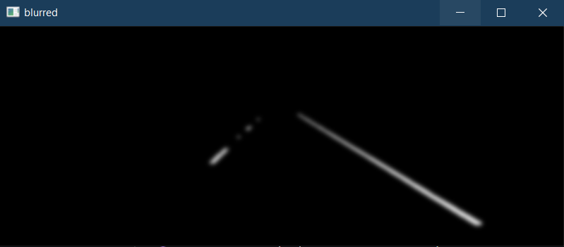
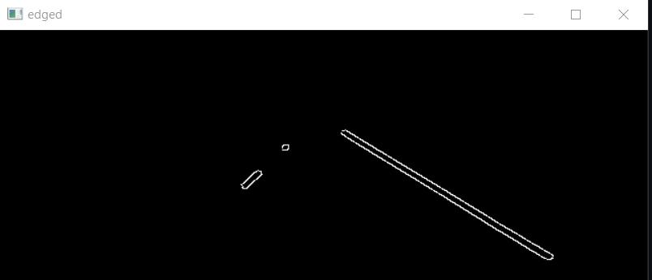

# Lane Detection on a Single Image

This script performs lane detection on a single image using OpenCV and NumPy. The process involves several image processing steps to isolate and highlight lane lines in a road image.

## Overview
- **Input:** A road image

- **Output:** The input image with detected lane lines overlaid

## Main Steps
1. **Image Snipping:** Crops the region of interest from the bottom of the image where lanes are expected.

2. **Masking:** Applies a polygonal mask to focus on the lane area.

3. **Thresholding:** Converts the image to HSV and grayscale, then applies a mask to highlight white lane markings.

4. **Blurring:** Uses Gaussian blur to reduce noise.
5. **Edge Detection:** Applies Canny edge detection to find lane edges.

6. **Line Detection:** Uses Hough Transform to detect lines corresponding to lane markers.
7. **Drawing Lines:** Averages detected lines and draws them on the original snipped image.

## Functions
- `snip_image(image)`: Crops the lower part of the image to focus on the road.
- `mask_image(image)`: Applies a polygonal mask to the image to isolate the lane area.
- `thresh_image(image)`: Applies color and grayscale thresholding to highlight lane lines.
- `blur_image(image)`: Applies Gaussian blur to the image.
- `edge_image(image)`: Detects edges using the Canny algorithm.
- `lined_image(image)`: Detects lines using the Hough Transform.
- `main()`: Orchestrates the lane detection pipeline and displays the result.

## Usage
Run the script directly:

```bash
python lanedetect_single_image.py
```

The result will be displayed in a window showing the detected lane lines.

## Requirements
- Python 3.x
- OpenCV (`cv2`)
- NumPy
- imutils

## Notes
- The script is designed for demonstration and may require parameter tuning for different images or camera perspectives.
- The region of interest and mask polygon are hardcoded for the sample image size.

---
Author: Ian Edmundson

